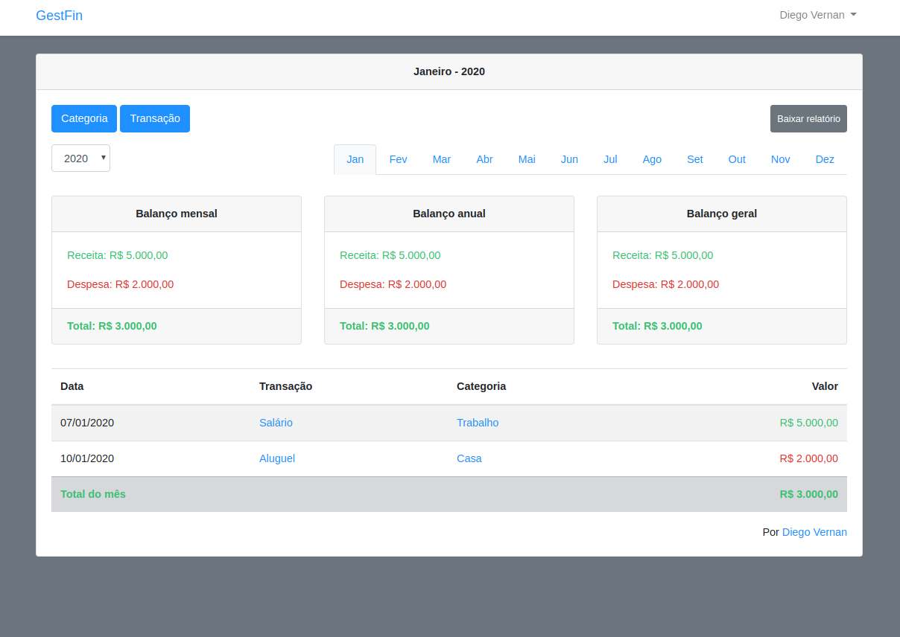
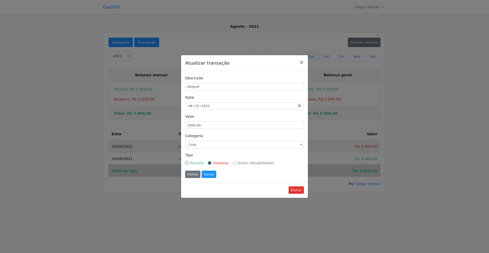
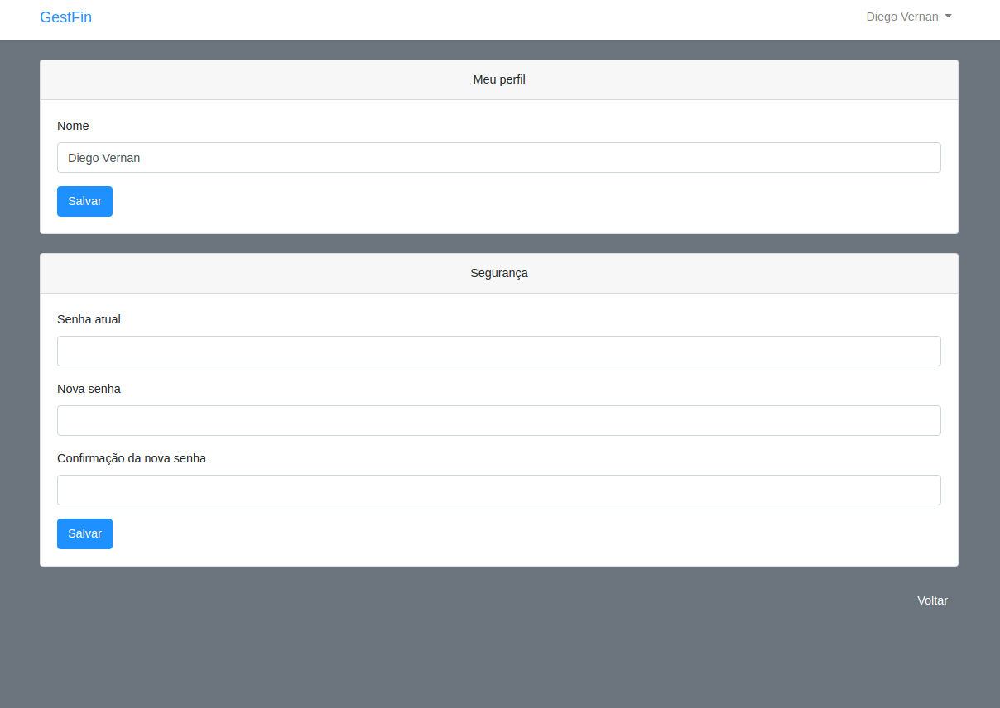

# GestFin - Sistema de gestão financeira (Laravel 6.X)

<!-- 



 -->


## Instalação em localhost

Clona o projeto via Https
```bash
$ git clone https://github.com/diegovernan/laravel_gestfin.git
```

Clona o projeto via SSH
```bash
$ git clone git@github.com:diegovernan/laravel_gestfin.git
```

Instala o composer
```bash
$ composer install
```

Copia arquivo .env.example para arquivo .env
```bash
$ cp .env.example .env
```

Gera chave
```bash
$ php artisan key:generate
```

Cria banco de dados vazio (MySQL)
```bash
$ mysql -uroot -proot
$ create database laravel_gestfin;
$ quit;
```

Configurar banco de dados no arquivo .env
```bash
DB_CONNECTION=mysql
DB_HOST=127.0.0.1
DB_PORT=3306
DB_DATABASE=laravel_gestfin
DB_USERNAME=root
DB_PASSWORD=root
```

Migra tabelas para o banco de dados
```bash
$ php artisan migrate
```

Configurar mailtrap no arquivo .env (mailtrap.io)
```bash
MAIL_DRIVER=smtp
MAIL_HOST=smtp.mailtrap.io
MAIL_PORT=2525
MAIL_USERNAME=seu usuário aqui
MAIL_PASSWORD=sua senha aqui
MAIL_FROM_ADDRESS=from@example.com
MAIL_FROM_NAME=Example
MAIL_ENCRYPTION=tls
```

Roda servidor local na porta 8000
```bash
$ php artisan serve
```
